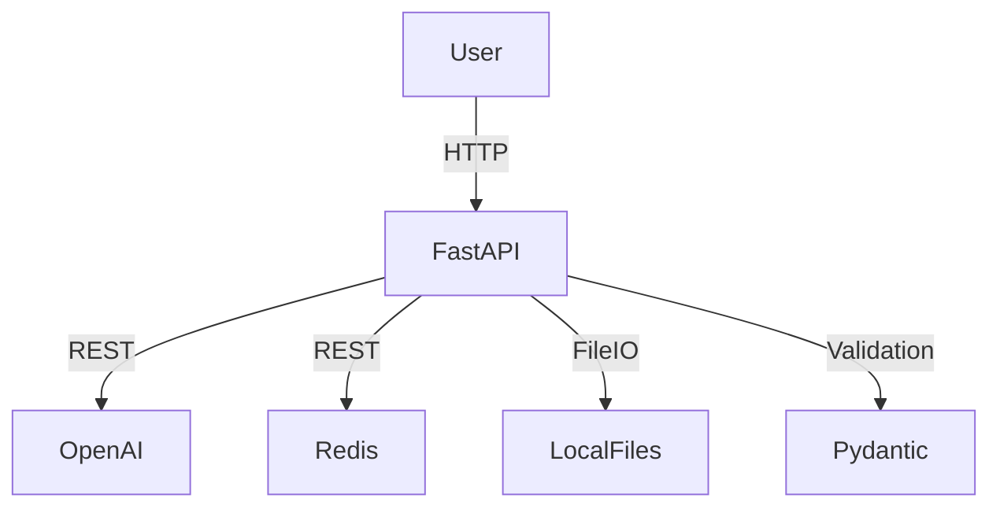

# Conversational RAG API


Conversational RAG API is a production-ready FastAPI backend for building conversational applications with Retrieval-Augmented Generation (RAG), chat session management, and a robust booking system. It integrates OpenAI for chat completions, Redis for fast storage, and supports .env configuration, advanced error handling, and extensibility for custom workflows.

---

## Architecture



---


## Features

- **Conversational Chat API**: Store and retrieve chat sessions, interact with OpenAI GPT models (GPT-4 Turbo).
- **Booking System**: Create, validate, list, and delete bookings with email and date validation.
- **Persistent Storage**: Uses Redis and local files for chat and booking history (JSON).
- **Async OpenAI Integration**: Fast, non-blocking calls to OpenAI's API.
- **Health Endpoints**: Check API, Redis, and OpenAI status.
- **.env Support**: Use a `.env` file for secrets and config.
- **Robust Error Handling**: Graceful fallback if Redis or OpenAI is unavailable.
- **Extensible**: Easily add new endpoints, models, or business logic.


## Requirements


Install dependencies from `requirements.txt`:

```bash
pip install -r requirements.txt
```


## Environment Variables


Create a `.env` file in the project root with:

```
OPENAI_API_KEY=your_openai_key
REDIS_URL=redis://localhost:6379
```


## Usage


Start the FastAPI server (with hot reload):

```bash
uvicorn main:app --reload
```


## API Endpoints


### Booking

- `POST /book/` — Create a booking (validates name, email, date, time)
- `GET /bookings/{booking_id}` — Retrieve a booking by ID
- `GET /all_bookings` — List all bookings
- `DELETE /bookings/{booking_id}` — Delete a booking


### Chat

- `POST /chat/` — Send a message to a chat session (handles booking intent, general chat, and context)
- `GET /chat_history/{session_id}` — Get chat history for a session
- `DELETE /chat_history/{session_id}` — Delete chat history for a session
- `GET /all_chats` — List all chat sessions


### Booking Session

- `GET /booking_session/{session_id}` — Get current booking session status
- `DELETE /booking_session/{session_id}` — Cancel an active booking session

### Health

- `GET /` — Basic health check
- `GET /health` — Detailed health status (Redis, OpenAI, storage)


## Data Storage

- **Redis**: Stores chat and booking data for fast access (ephemeral, 24h expiry)
- **Local Files**: Chat sessions in `chat_sessions/`, bookings in `bookings.json` (persistent backup)


## Example Usage


### Create a Booking

```bash
curl -X POST "http://localhost:8000/book/" \
	-H "Content-Type: application/json" \
	-d '{"name": "Alice", "email": "alice@example.com", "date": "2025-10-01", "time": "14:00"}'
```

### Chat with Context

```bash
curl -X POST "http://localhost:8000/chat/" \
	-H "Content-Type: application/json" \
	-d '{"session_id": "abc123", "message": "I want to book an appointment for tomorrow at 2pm. My name is Alice."}'
```

### Get Chat History

```bash
curl http://localhost:8000/chat_history/abc123
```


## .env Example

```
OPENAI_API_KEY=sk-...
REDIS_URL=redis://localhost:6379
```


## Error Handling

- If Redis is unavailable, the API falls back to file storage.
- If OpenAI is not configured, chat endpoints return a clear error.
- All endpoints return meaningful HTTP status codes and error messages.

## Extending the API

- Add new endpoints by defining FastAPI routes in `main.py`.
- Add new models using Pydantic.
- Integrate additional external APIs or business logic as needed.

## License

MIT License